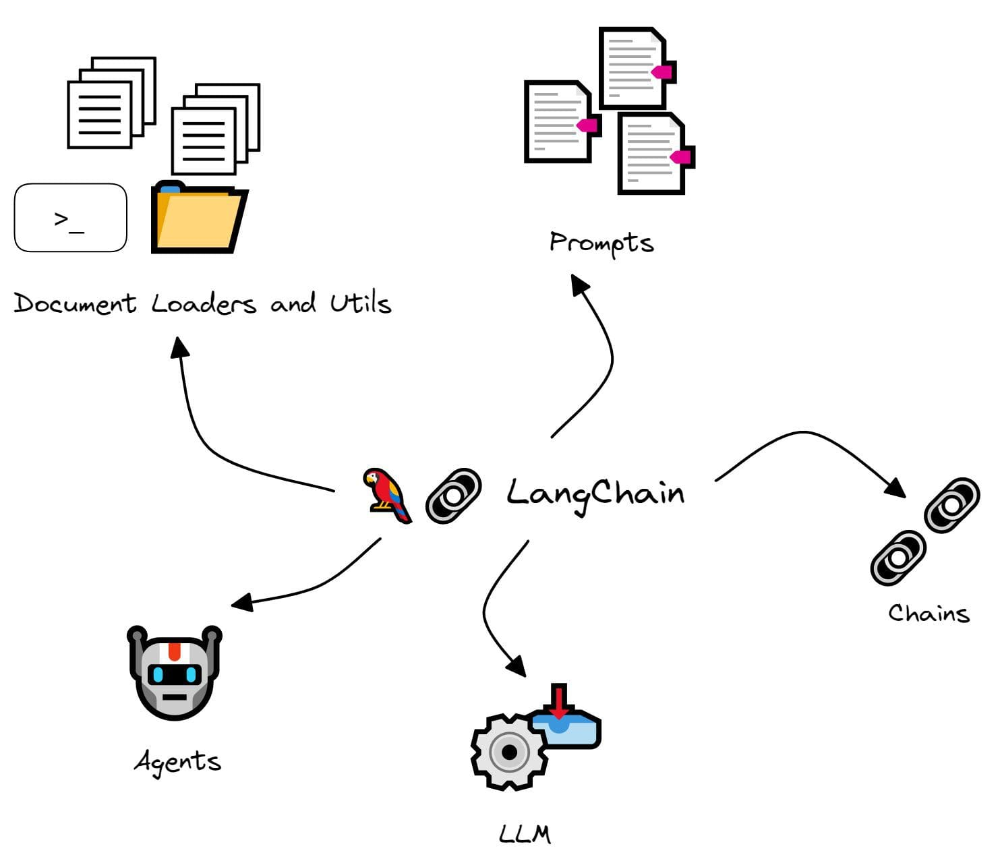
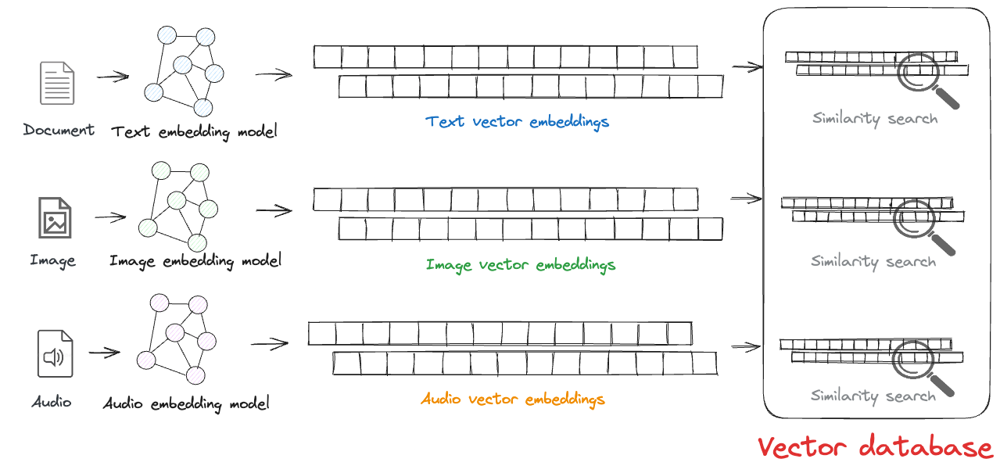
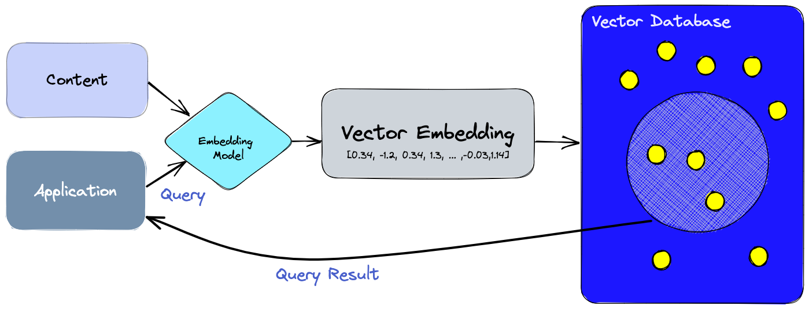
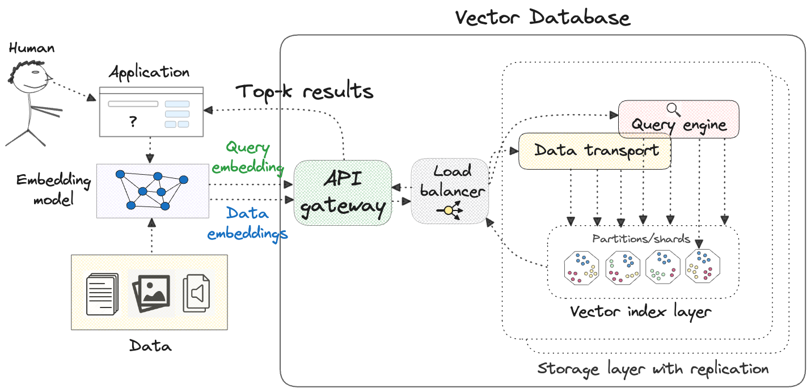
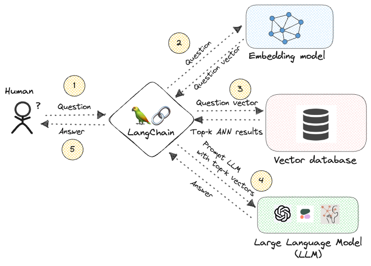
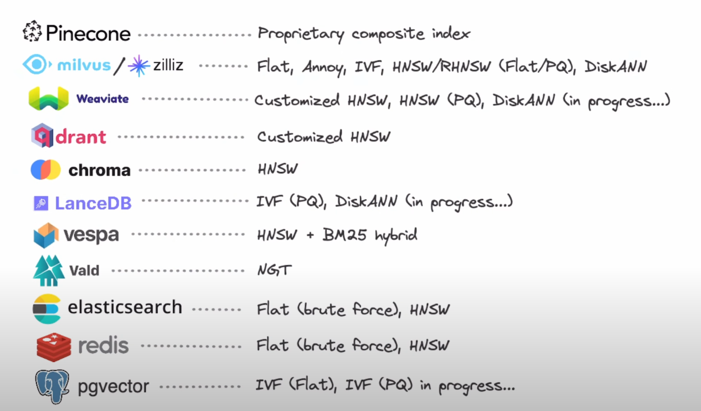
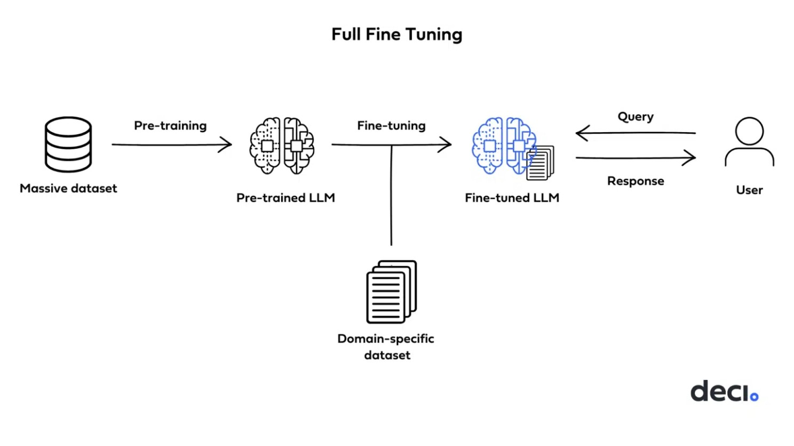
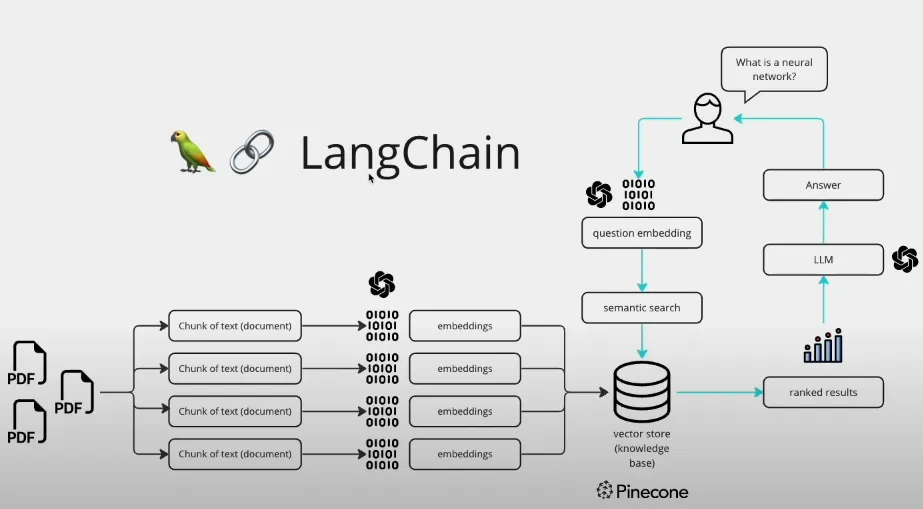

# What is LangChain?

LangChain is an open-source framework designed to simplify the process of building applications that use large language models (LLMs). LLMs are powerful AI models trained on massive amounts of text data, allowing them to generate text, translate languages, write different kinds of creative content, and answer your questions in an informative way.

LangChain provides tools and abstractions that make it easier for developers to:

Connect LLMs to external data sources: This allows applications to access and process information from various sources beyond the LLM's training data, improving the accuracy and relevance of the model's responses.
Customize prompts: Prompts are instructions given to the LLM that guide its response. LangChain allows developers to refine and customize prompts to achieve the desired outcome.
Build complex applications: By combining different LangChain components, developers can create sophisticated applications that leverage the capabilities of LLMs.
Overall, LangChain aims to make LLM development more accessible and efficient, enabling a wider range of developers to build innovative applications powered by these powerful language models.

# What is VecterDB

## Storing the embeddings in vector databases

<!--  -->
## Approximate nearest neighbours (ANN)

## Generative QA: “Chatting with your data”

## Database

# Demo

## Full fine-tuning

### Full fine-tuning in 6 steps
To illustrate, let’s say we want to build a tool that generates abstracts for biotechnology research papers. For full fine-tuning, you’ll need to go through the following steps: 
#### 1. Create the dataset
Collect a set of research papers from the target domain of biotechnology. Ensure each paper comes with its original abstract.
Split this collection into training, validation, and test sets.
#### 2. Preprocess the data
Convert each research paper into a format amenable to the model. 
Pair each processed paper content with its corresponding abstract to form input-output pairs for supervised training.
#### 3. Configure the model: 
Load the pre-trained LLM (e.g., a pre-trained version of GPT-4).
Decide on hyperparameters for fine-tuning, such as learning rate, batch size, and number of epochs, based on preliminary tests or domain knowledge.
#### 4. Train the model:
Feed the processed content to the LLM as input and train it to generate the corresponding abstract as the output.
Monitor the model’s performance on the validation set to prevent overfitting and to decide when to stop training or make adjustments.
#### 5. Evaluate performance: 
Once fine-tuning is complete, assess the model’s performance on the test set, which it hasn’t seen before.
Metrics might include the BLEU score, ROUGE score, or human evaluations to measure the quality and relevance of the generated abstracts as compared to the original ones.
#### 6. Iterate until performance is satisfactory: 
Based on evaluation results, iterate on the above steps, possibly collecting more data, adjusting hyperparameters, or trying different model configurations to improve performance.

## Text Q/A App

